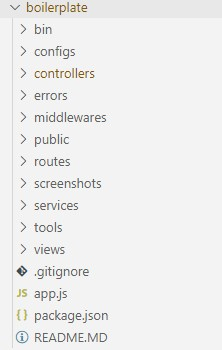
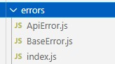
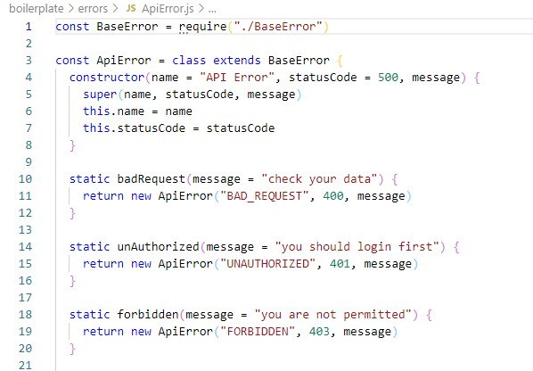
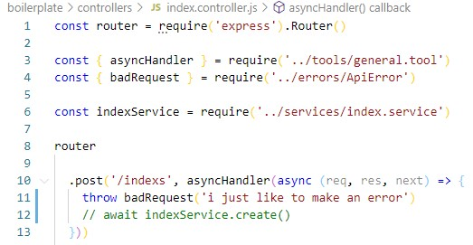
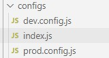
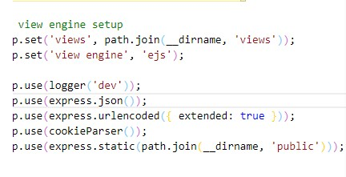

# Express Rest API & Boilerplate Generator

### Create  an app from scratch with ***Boilerplalte*** or  ***Generate services and controllers*** by simple ***CLI commands***  based on latest conventions of coding.  

   We have tried our best to use Restful conventions in our boilerplate and codes.

## Features

  - a **Boilerplate** to start a project from scratch with neccessary configs and structure.
    
  - **CLI Commands** to simply create project parts: `services`, `controllers` or even whole `project structure`.
    > we will try to make it much better in futrue, any suggestions would be appreciated by all users.
    
  - **Error Handling System**.

  - pre configed **dotenv structure** to bring environment variables.   
  -  and more **hidden features** like `async handler`.
  
## CLI Commands
  - makes a new app  `xpg -n [app name]`
    > this command will create a complete project based on model-view-controller and services which is api based and all layers are seperated.
  - makes both controller and service `xpg [model name]`  
  - generate controller `xpg -c [controller name]`
  - generate service `xpg -s [service name]`
  > `xpg -h` will show a list of commands .

## Async Handler
  - async handler function will wrap all controllers so you will never need to use try-catch in any of your express apps.  
      
 
## Error Handling System
  - very flexible error handling system.    
    
   this system has been designed and covered all required status codes for your errors.
    
  **Methods :**  
    - badRequest  
    - unAuthorized
    - forbidden
    - notFound
    - internal
    - badGateway
    - unAvailabe
    - gatewayTimeout  
  
    **Usage :** 
    - import any of static methods from error directory inside `ApiError` file.  `\errors\ApiError.js`  
    - call imported method and pass your custom message or it will use default message.  
  

  ## Hidden Features
  - pre configured environment variable configurations for **development** and **production**  which uses `dotenv` package.  
  
  - other pre configurations like: 
    - session & cookie parser
    - logger for routes that uses `morgan`
    - `EJS` view engine
    - static files directory in `public` folder 
    - extended `urlencoded`  

> note: this is an open source project, feel free to clone.  
> if you have any suggestions we appreciate you make an issue.

> ### Hope You Enjoyed Using This Package ❤️❤️❤️.